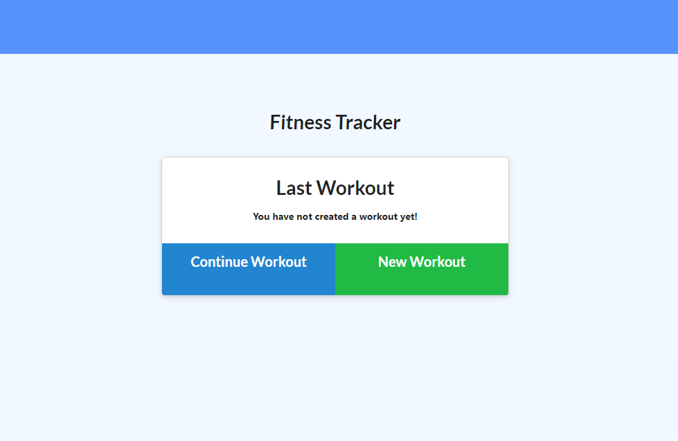

## Workout-Tracker

- [Description](#Description)
- [Installations](#Installations)
- [Licence](#Licence)
- [Contributing](#Contributing)
- [User Story](#User-Story)
- [Acceptance Criteria](#Acceptance-Criteria)
- [Test](#Test)
- [Credits](#Credits)
- [Questions](#Questions)

## Description

Simple application that allows user to track work outs. Add workouts, track the time you workout and see stats per week.


## Installations

clone  and `npm i`

## Contributing

none at this time

## User-Story

```
As a user, I want to be able to view create and track daily workouts. I want to be able to log multiple exercises in a workout on a given day. I should also be able to track the name, type, weight, sets, reps, and duration of exercise. If the exercise is a cardio exercise, I should be able to track my distance traveled.
```

## Acceptance-Criteria

```
When the user loads the page, they should be given the option to create a new workout or continue with their last workout.

The user should be able to:

  * Add exercises to a previous workout plan.

  * Add new exercises to a new workout plan.

  * View the combined weight of multiple exercises on the `stats` page.
```

## Licence

[](https://opensource.org/licenses/Apache-2.0)

## Test

[](https://todo-workout-fitness-tracker.herokuapp.com/)

## Credits

Trilogy Teacher, Ta and Staff

## Questions
Contact me on my socials
<br>
-Email: [danielsoledad@gmail.com](mailto:danielsoledad@gmail.com)
<br>
-GitHub Username: [tuzosdaniel12](https://github.com/tuzosdaniel12) 
